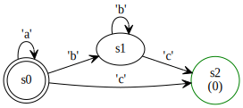

# Regex2Graph

A Converter from Regex to DFA Graph(using [graphviz-kotlin](https://mvnrepository.com/artifact/guru.nidi/graphviz-kotlin))

Initially be designed for helping me to complete my assignments of *Principles of Compilation *



## Build

1. build using `Gradle`
```bash
./gradlew build
```
then you can use `build/libs/Regex2Graph-fat-1.0-SNAPSHOT.jar` directly.

## Usage

```bash
java -jar build/libs/Regex2Graph-fat-1.0-SNAPSHOT.jar [-o <output svg filename>]
```
Then it can translate Regex from stdin to `.svg` file.

## Limitations

1. Only 1 regex(in first line) can be process.
2. Doesn't have Syntax Check to Regex input.
3. Only `Concat`,`Or`,`Brackets`,`Question mark` and `Kleene star` can be process.
4. In output, it doesn't merge ranges, so the graph may be a little complicated.